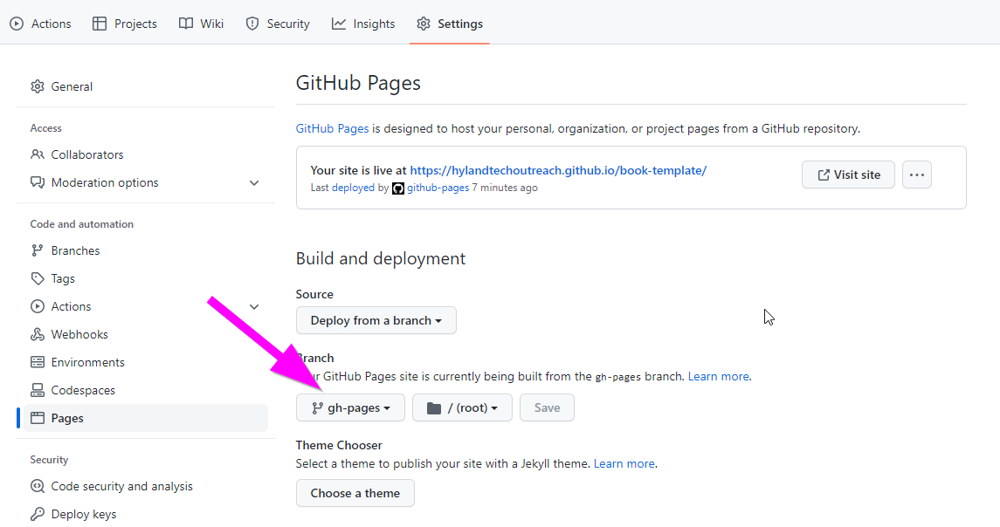

# Curriculum Development Procedures
This page contains information about contributing to the Tech Outreach curriculum.

## Examples
Looking at examples of existing programs might be the best way to start learning how to contribute.

### Hy-Tech Camps
There are a variety of Hy-Tech Camp workshops, each with lesson plans available [here](https://github.com/hytechcamps/). These are meant to be a brief introduction to one concept, designed for about 2 hours in length. A few examples:

- [Animation for Games](https://github.com/hytechcamps/animation)
- [Python](https://github.com/hytechcamps/python)
- [Blockchain](https://github.com/hytechcamps/blockchain)

Student material for these workshops is surfaced via [hytechcamps.github.io](https://hytechcamps.github.io/).

### Hy-Tech Club
There are several [Hy-Tech Club courses](https://github.com/hytechclub/) available. These courses are designed to run for 12 weeks, with each week containing one ~2-hour session. Here are some examples:

- [Web 101](https://github.com/hytechclub/web-101)
- [Python 201](https://github.com/hytechclub/py-201)

Student material for these workshops is surfaced via [hylandtechclub.com](https://hylandtechclub.com/).

### Other Repositories
In addition to the Hy-Tech Camps and Hy-Tech Club organizations, there are other examples on the main [Hyland Tech Outreach GitHub](https://github.com/hylandtechoutreach). Here are some:

- [UCS](https://github.com/hylandtechoutreach/ucs)
    - This program runs one day per week on a trimester basis at Urban Community School
- [Coding Activities](https://github.com/hylandtechoutreach/coding-activities)
    - This repository contains a variety of bite-sized coding activities that can be used for field trips or other events

## Typical Lesson Flow
Most lessons follow a fairly standard structure.

### Icebreaker / Warm-Up
_An activity to kick off the lesson and motivate the students_

- This should be a fun way for the class to get to know each other better
- This can also be an opportunity to introduce the topics of the lesson
- For a multi-session program, this could be a review or practice activity
- This could also be a fun video with some relevance to computer science

#### Example
[Here](https://hytechcamps.github.io/machine-learning/Icebreaker.html) is an example from the Machine Learning Hy-Tech Camp. Students have the opportunity to draw something using an AI-assisted drawing tool, and then share their drawings with the group while introducing themselves.

### Lecture
_A presentation (generally using PowerPoint) containing content for this week_

- The focus here is to familiarize students with concepts, even if they do not grasp them fully
- These should be interactive and include space to ask questions to the students (and have them ask questions)
- Some lessons are more PowerPoint-heavy, some do not require much
- It is preferable to add pictures, animations, videos, and other hooks to engage the students

#### Example
[Here](https://view.officeapps.live.com/op/view.aspx?src=https%3A%2F%2Fhylandtechclub%2Ecom%3A443%2Fpy%2D201%2FCollections%2FCollections%2Epptx&wdSlideId=325&wdModeSwitchTime=1660652822326) is an example from the Python 201 Hy-Tech Club course. This one is a little longer, but involves some fun topics that students should hopefully enjoy.

### Formative Assessment
_A quick way to test if students retained any material from the lecture_

- These assessments help instructors figure out what the students learned well, and what topics may need review
- They are typically designed to be engaging for the students as well
- Generally, these are [Kahoot](https://kahoot.com/), [Quizizz](https://quizizz.com/), or [Blooket](https://www.blooket.com/) quizzes
- They can also be other types of review games

#### Examples
- [**Here is a Kahoot example.**](https://create.kahoot.it/share/d71c1d5e-a563-4e00-a61a-fa498c71942b). These are instructor-led, so the instructor should start the game, click through each question, and comment on the answers. They are more helpful for actually reviewing the material as a group.
- [**Here is a Quizizz example.**](https://quizizz.com/admin/quiz/5c6ade2097b82c001a18541b). These are self-paced for the students, so all the instructor has to do is start the game. They are helpful for actually assessing the progress of each individual student. To run a Quizizz quiz, an account is required.
- [**Here is a Blooket example.**](https://dashboard.blooket.com/set/62a0fa2f78f3c51ef02f8371). These are mostly self-paced for the students, but there are several different game options. They are generally meant to focus on the fun aspect, but can be very helpful when trying to practice rote memorization. To run a Blooket quiz, an account is required.
- [**Here is a PowerPoint Game example.**](https://github.com/hytechclub/web-101/blob/master/Week02/NameThatElement.pptx) This is one way to create a more customized review game experience. Instructions should be provided in the lesson's **README.md** file, or in the PowerPoint itself.

### Follow-Along Activity
_An Instructor-led, hands-on activity that should engage students_

- These should have clear instructions that both instructors and students can follow
- They should also contain explanations for the concepts covered; they should not simply list out the steps to follow
- The instructor should ask the students how to proceed during these activities
- These are often code-along activities, where students write the same code as the instructor (possibly with some customization)
- These can also be more general follow-along activities
- It is often beneficial to include screenshots within the instructions

#### Examples
- [Here](https://hytechcamps.github.io/python/TurtleCodeAlong.html) is an example of a code-along from the Python Hy-Tech Camp. Note that code is available with each step, and the final code is provided at the end.
- [Here](https://hytechcamps.github.io/machine-learning/FollowAlong.html) is an example of a more general follow-along from the Machine Learning Hy-Tech Camp. Note that there are screenshots for the instructions to guide both instructors and students.

### Self-Paced Exercises & Challenges
_Exercises for students to complete on their own or with other students_

- During these exercises, students can ask for help from their peers or from instructors
- This is a good opportunity for instructors to help students on an individual basis
- All students should be able to complete the basic exercises, but no student should be able to complete all the challenges
- Depending on the type of program and the timing, these may make the most sense to cut

#### Example
[Here](https://hytechcamps.github.io/animation/AnimationChallenges.html) is an example of some challenges from the Animation Hy-Tech Camp. Note that there are several options - the instructions for some options are very open-ended, but for other options they are very specific. Students should be able to follow these instructions without any assistance from an instructor, so they must be clear and detailed (at least for the basic exercises).

### Wrap-Up
_A way to end the session_

- This can be an opportunity for students to complete a [feedback survey](https://forms.gle/wryBM9WGheDo6JPbA)
- This can be a great time for students to [share their work](https://hytechcamps.github.io/python/SharingWork.html)
- There may be an "exit ticket" or other review to close things out
- If there are any important closing remarks, they should be given here

## Technical Details
In addition to the actual content of the curriculum, there are several implementation details that are important to note. This section covers the storage and deployment of the curriculum for Tech Outreach programs.

### GitHub
All content for Tech Outreach programs should be stored on [GitHub](https://github.com/). There is a [**hylandtechoutreach**](https://github.com/hylandtechoutreach/) account that owns each repository, in addition to the [**hytechclub**](https://github.com/hytechclub/) organization and the [**hytechcamps**](https://github.com/hytechcamps/) organization.

GitHub uses Git to allow the Tech Outreach team to store all material in a standard, accessible way. Curriculum developers can use version control to keep track of all updates and changes, as well as collaborate on programs.

In general, the content visible directly within GitHub repositories is designed to be instructor-facing. Student-facing content is surfaced through GitBooks. Note that the content on GitHub is still open-source (e.g., not private or secure); it is simply not shown directly to students.

There is an [Intro to Git](https://hylandtechoutreach.github.io/hackathon/IntroToGit/StudentDesc.html) workshop that may be helpful for beginners.

### Markdown
Lesson plans, follow-along instructions, landing pages, and more are written using [Markdown](https://en.wikipedia.org/wiki/Markdown). This has a number of advantages - one of the most important is that it is easy to render Markdown pages in a nice web format (both on GitHub and through GitBooks), and it is easy to track and review changes.

[This Markdown tutorial](https://www.markdowntutorial.com/) is a great place to start learning Markdown. Markdown files end with **.md**. They can be edited and previewed in VS Code, or directly on the web through GitHub. Editing them is somewhere in between editing a Google Doc and writing an HTML file (markdown actually does support most HTML elements). It can take some time to become accustomed to it, but it is a very helpful tool.

#### Style Guide
There is not currently a specific style guide for Markdown files. However, there should be one! For now, other repositories are a good point of reference for stylistic choices.

A few things to note:

##### Assets Folder for Images
When adding images to markdown files, the images should be placed in a folder in the repository named **Assets**. They can be accessed like so:

```md

```

##### Embedded PowerPoints/Videos
Use HTML `<iframe>` elements to embed PowerPoints or YouTube videos. A `width` of `"100%"` and a `height` of `"450px"` tend to work well. For PowerPoints, it is possible to embed them using [Microsoft Office online](https://office.com). After a PowerPoint has been published via GitHub Pages, it will be available for embed online. There is a special URL where the path to the PowerPoint will be used; the `src` _within_ the URL (not the `src` of the `iframe`) should match the location where the PowerPoint is surfaced. It may be necessary to change the base URL depending on which organization holds the repository, and from there, it will be a matter of filling in the correct path to the PowerPoint. It should end up looking something like this:

```html
<iframe src='https://view.officeapps.live.com/op/embed.aspx?src=https://hytechcamps.github.io/blockchain/Blockchain.pptx' width='100%' height='450px' frameborder='0'></iframe>
```

For general purposes, this block of code can be copied and modified with the new URL.

### GitBook
All student-facing content is surfaced via [GitBook](https://github.com/GitbookIO/gitbook). GitBooks make it possible to view markdown-driven material in an easily-accessible web format. The integration with the actual GitHub content should be fairly seamless at this point, but it may be useful to understand how the process works.

#### GitBook CLI Tool
Although the [GitBook CLI tool](https://www.npmjs.com/package/gitbook-cli) is deprecated, it still seems to work pretty well for Tech Outreach purposes. This is a command line tool that takes the contents of a folder and builds/serves a GitBook from them. This tool comes in handy in cases where it is desired to check what something will look like when it is published without actually publishing it.

#### GitHub Action
There is a [GitHub Action](https://github.com/features/actions) set to run each time the repository has a push. This action is defined in a specific file in a specific folder: **.github/workflows/BuildGitBook.yml**. The specific name of the file can change, but the folder structure and filetype are very important. This action uses the GitBook CLI tool to build a new GitBook, and store the code for it on the `gh-pages` branch of the repository.

#### GitHub Pages
[GitHub Pages](https://pages.github.com/) is a simple way to publish websites based on the contents of GitHub repositories. In this case, the `gh-pages` branch contains all of the code for the website to be published. For a new repository, it will be necessary to turn on GitHub pages and make sure it is built from the proper branch:



#### Example
[Here](https://hylandtechoutreach.github.io/peeke-2022/) is an example of a published GitBook. All of it is built from the content in [this repository](https://github.com/hylandtechoutreach/peeke-2022).

## Considerations
When developing new curriculum, there are a few important things to keep in mind.

### Hybrid Accessibility
Since CoViD-19, many Tech Outreach programs have had a virtual aspect. In general, it is best to prepare curriculum in such a way that it would be offerable in an in-person, virtual, _or_ hybrid format. Always make sure virtual students can be included in all activities, and there are mechanisms in place for incorporating both types of experience into a session. This could be designed out-of-the-box, or there could be alternatives for some activities.

### Replit / Online IDEs
One thing that helps a lot with the hybrid format (and a lot of other things) is [Replit](https://replit.com/). Replit is an online IDE that supports a large number of languages (including HTML/CSS/JS, C#, NodeJS, and Python). It makes it quite easy to share code projects. Instructors can share starter code with students, and students can access their code from anywhere. Replit also has a feature called [Mulitplayer](https://replit.com/site/multiplayer), which allows for simultaneous editing and live chat. This can help students collaborate, and can also allow instructors to assist students virtually in a fairly simple way.

As IDEs go, Replit is far from perfect. It is not always the most reliable, and often requires reloading. They also update it fairly often, which is a double-edged sword; it is nice to have new features, but it often requires re-learning (and re-teaching). All that said, Replit is the best solution the Tech Outreach team has found for dealing with code management across clubs, camps, and other programs.

There may be other online IDEs that make more sense for certain projects, or perhaps for the future of all programs - but for now, Replit is the way to go.

### Reusability
When designing curriculum for a specific program, it is important to consider reusability. Ideally, all curriculum would be modular enough to plug into any event or program with just a few tweaks. However, quality should _not_ be sacrificed in favor of reusability. Sometimes, specific programs require specific solutions. There are no well-defined guidelines for dealing with this question, but it is necessary to think about it. When possible and easy, create material that could be leveraged in many situations. Otherwise, focus solely on the success of the program itself.

#### Example
When defining a schedule/agenda for a session, use duration instead of timestamps. Use something like this:

| Activity | Time |
|-|-|
| Warm-Up | 15m |
| Code-Along | 45m |

instead of this:

| Activity | Time |
|-|-|
| Warm-Up | 10:00-10:15 |
| Code-Along | 10:15-11:00 |

### Other Instructors
Curriculum should be designed in such a way that anyone can teach it. This is especially true with Tech Outreach, because instructors are recruited from a variety of areas and have a vast range of different skills. In some instances, Tech Outreach curriculum has even been used by external organizations. It is crucial to consider all of those future instructors. Curriculum should assume no prior knowledge; any instructor should be able to read through the lesson plan and understand the concepts enough to teach them. Instructions for activities should be as clear and detailed as possible, with in-depth explanations when necessary. Theoretically, anyone should be able to learn one of these topics simply by reading through the curriculum itself and completing the activities.

#### Videos and Scripts
To that end, it can be extremely helpful to include videos and scripts. Typically, a video is recorded for both the lecture and the follow-along activity. This allows future instructors (or even future students) to see someone bring these materials to life. The videos should be student-facing in nature, although it may also be helpful to include important instructor-facing notes in another form.

It may be helpful to write a line-by-line script for the presentation. This will allow anyone who can read to present the material. It should not be necessary to include a script for the follow-along; the actual instructions themselves should essentially act as a script in this case.

## Actually Developing Curriculum

### Creating Something New

### Contributing to an Existing Project
